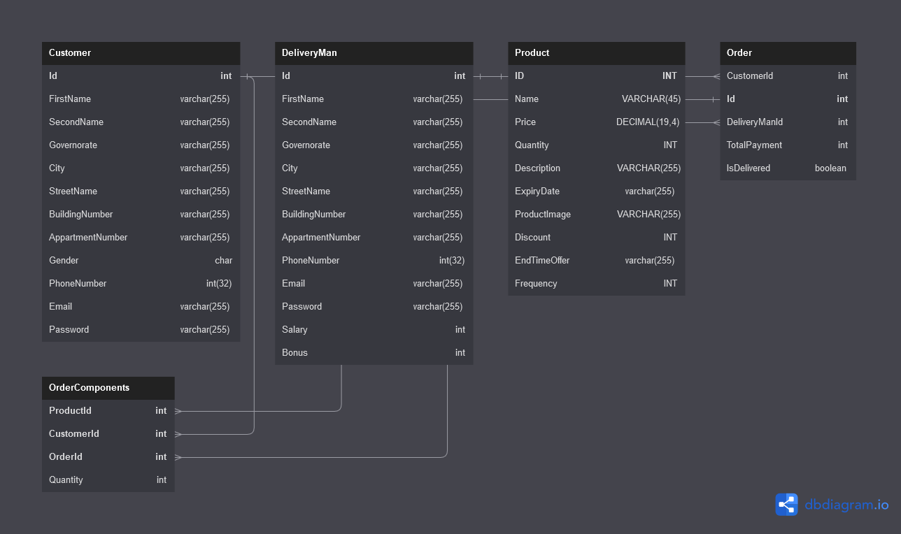
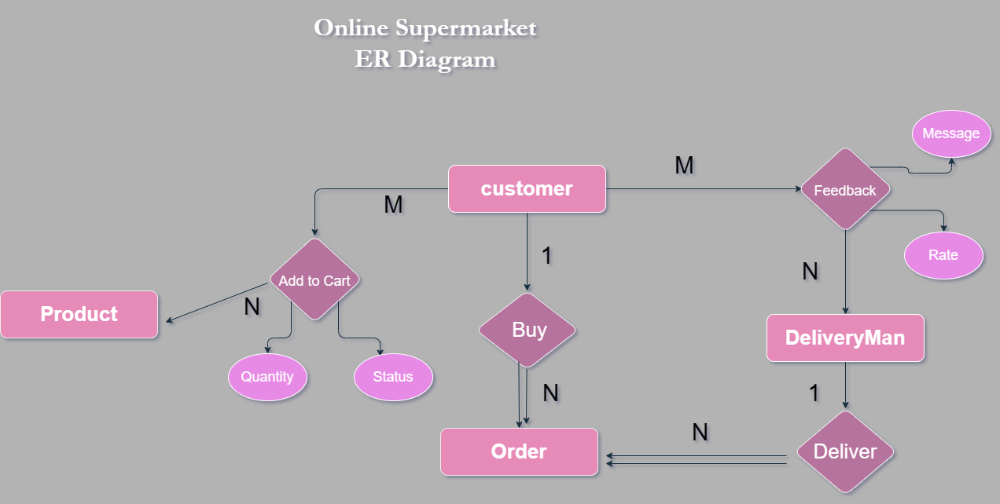
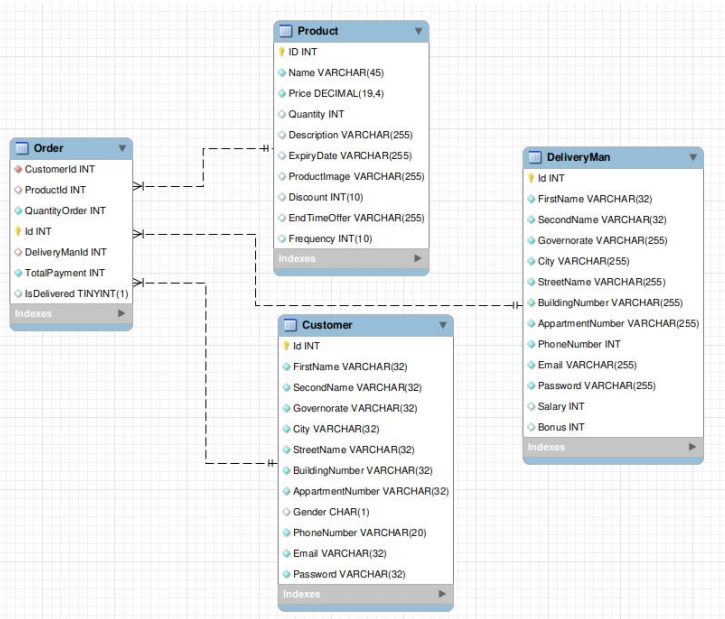
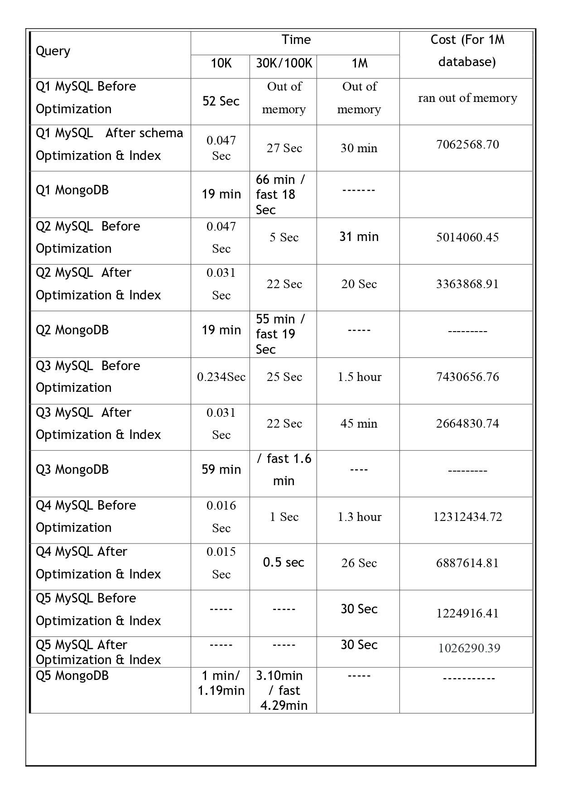

# DB-Tuning-Optimization-and-Analysis
In this project, We aim to test some queries on different sizes of same schema and optimized schema then analayze the performanc in MySQL and MongoDB Our datbase is called `OnlineStore`.

Database record sizes:
* 10 thousand
* 100 thousand
* 1 million

We used **DBForge** for data seeding.

The 3 sizes is applied for both the normal schema and optimized schema, thus we have 6 schemas in **MySQL** datbase.

Also the 100-thousand database record size is applied on **MongoDB** on the optimized schema.

We applied the project on 2 phases:
1. Proposal phase [phase 1]
2. Implementation phase [phase 2]

## Phase 1
This is the schema:

This is the ER Diagram:

## Phase 2
In this phase, we applied optimization on database. 4 types of optimization were applied:
1. Optimizing the schema.
2. Optimizing the memory requirements.
3. Optimizing the queries.
4. Adding Indeces.

1. Optimizing the schema
This is the schema after optimization

We merged 2 tables(order and orderComponent -> OrderOptimized), to make less joines.

2. Optimizing the memory requirements
We changed the block size to increase its buffer, to speed up the join.

3. Optimizing the queries
Instead of using cross product, we used join.

4. Adding Indeces
By default, MySQL put index for primary keys, so add index in the table that have lots of foreign keys.
We put compound index on the 3 foriegn keys in orderOptimized to speed up the lookup for join.

Here is the Database Analysis after each optimization:

In each sql file, we put the schema and indeces in addition to the queries applied with their running time, cost and tree excution plan.

For furthur documentation and details, check our [`Report`](https://github.com/reem-atalah/DB-Tuning-Optimization-and-Analysis/blob/main/phase2/Report.pdf)
